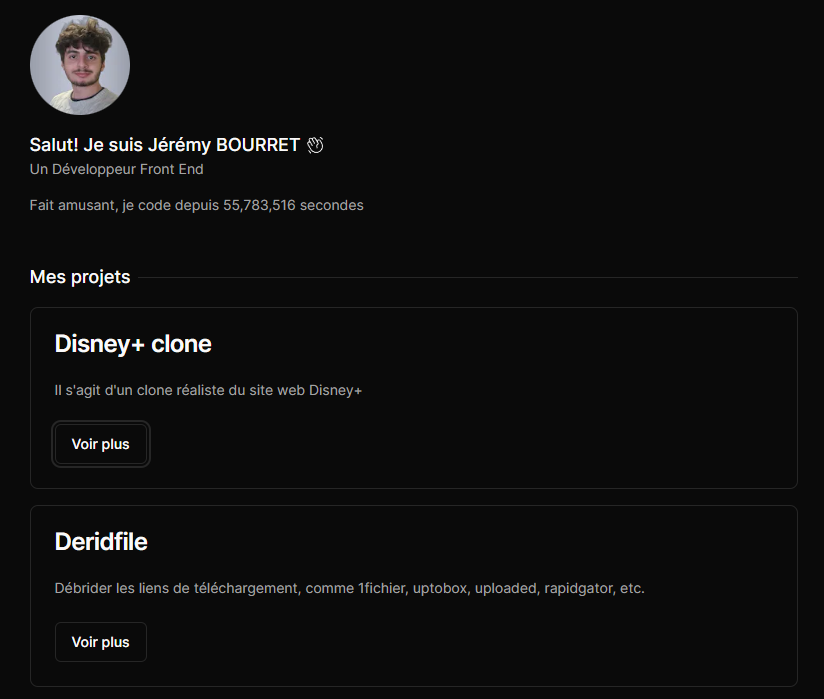
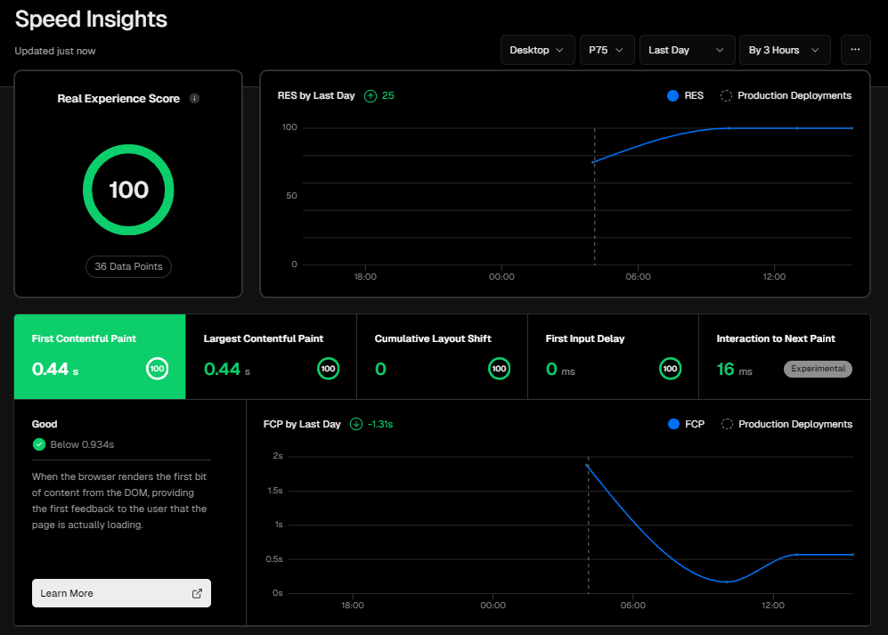

# Mon Portefeuille

Bienvenue sur mon portefeuille GitHub! Ce dépôt contient le code source de mon site Web personnel.

## Aperçu

## Vercel Speed Insights

[Vercel Speed Insights](https://vercel.com/jeremy84100/portofolio-5ucp/speed-insights?device=desktop&timePeriod=1d&percentile=75&timeInterval=3h&sort=datapoints&search=) est un outil puissant pour évaluer les performances d'un site Web. Mon site a été optimisé pour offrir une expérience utilisateur optimale. Voici les résultats actuels:

Pour améliorer les performances, assurez-vous de suivre les recommandations de [Vercel Speed Insights](https://vercel.com/jeremy84100/portofolio-5ucp/speed-insights?device=desktop&timePeriod=1d&percentile=75&timeInterval=3h&sort=datapoints&search=).

## Technologies Utilisées

- NextJS
- Tailwind
- TypeScript

## Installation

1. Clonez ce dépôt: `git clone https://github.com/Jeremy84100/portofolio.git`

## Licence

Ce projet est sous licence MIT. Voir le fichier [LICENSE](LICENSE) pour plus de détails.
